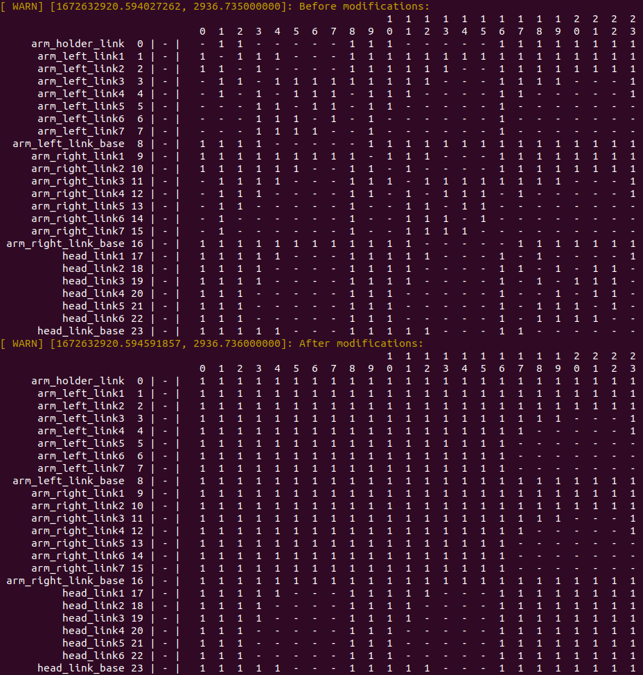
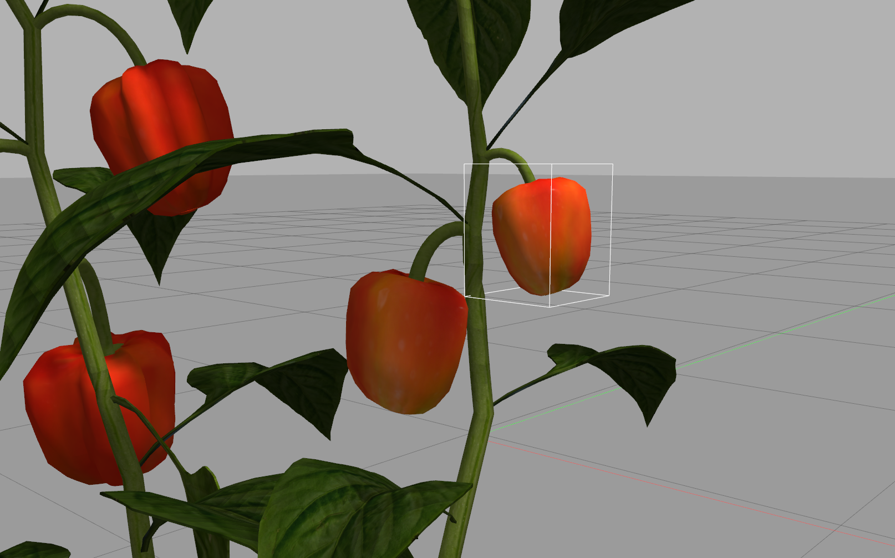

# Salih's Master Thesis with Rohit

[toc]

## To-Do

Note: This section can be confusing. Please check the [Meetings](#meetings) section instead.

- [x] Prepare detachable capsicum plant models.
- [x] grasping plugin
- [ ] gripper and cutter gazebo models

- [ ] bioIK
  - [ ] LookAtGoal
  - [ ] minimal displacement goal, etc.
- [ ] maybe move to see while fruit is being cut but find the initial position with our method panoptic mapping and feed with via a basic pixel and depth based fake panoptic segmentation superellipsoid shape detector
- [ ] try wbc only for camera arm
- [ ] try move to see for camera arm

- [ ] very end of the thesis: 
  - [ ] arm priority:
    - head arm high priority
    - manipulator high p.
    - equal p.

## Meetings

Note: Some meeting notes may not be available.

### 02 Jan 2023

Current task is to make Bio-IK be able to detect collisions and find distances to the nearest collision (for cost computations).

My findings:

- **Q: How about using FCL directly?**
  A: Directly using FCL may not be a wise decision. Adding all links from scratch and computing collision distance will be slow.

- **Q: How to speed up collision computations?**
  A: First solution would be not computing it at all. For example, if there are two arms with 50cm distance to each other, and there are closer objects to the main arm, it wouldn't be wise to compute distances to the other arm (unless it has moved!). If I am not wrong, this idea is implemented as a **manager** class (e.g. DynamicAABBTreeCollisionManager) so all objects can be managed/tracked for efficient computations.  (AABB: Axis-Aligned Bounding Boxes)

- **Q: Is FCL fast enough?**
  A: According to some posts, Bullet is faster: https://github.com/tesseract-robotics/tesseract/discussions/668. For our case, MoveIt supports both. It would be a wise decision to use MoveIt so we can also benchmark these timings.

- **Q: Does Bullet Manager run multi-threaded?**
  A: Probably not. There are mutex's for collision checking: https://github.com/ros-planning/moveit/blob/master/moveit_core/collision_detection_bullet/src/collision_env_bullet.cpp . Creating multiple collision managers is also possible.

- **Q: Do we need to build a collision matrix for computations?**
  A: I don't think so. The manager should be able to handle this.
  
- **Q: Should we use cylinders and spheres for efficient computations?**

  A: XArm developers say it may not be necessary: https://github.com/xArm-Developer/xarm_ros/issues/75 If it is a problem, URDF/SDF models can be simplified via MeshLab. I think, using cylinders and sphere must be the last thing we should do to speed up the implementation process.

- **Q: How to compute meaningful distances?**

  A: The first task is to avoid crashing into other arms. These arms will have a Allowed Collision Matrix which should be ignoring the head arm, so they can plan solutions without constraining themselves to the head arm. When it comes to the answer to this question, the head arm should only compute distances to other arms. So, we need a Allowed Collision Matrix with values set to false between head arm and other arms. Also, Self-collision distance can be solved similar to this way.

  **Extra**: I have experimented computing collision distances between head arm and other arms, and succeeded doing computations with ~350Hz (2.8ms) without doing any model simplifications.

  

- **Q: Self-distance vs other-robot distances? Why not combine into one?**

  I think, combining both would force the robot to move to singularity. Alternatively, instead of self-distance, self-collision cost (very very high value) can be added to do rejection sampling.

- **Q: How to move the arm reactively?**

  I think, the only solution is to move the arm like `moveit_servo` does. 


### 07 Dec 2022

- Bio-IK LookAtGoal works well. It also works great with minimal displacement goal. **But...** IK runs without collision avoidance. I tried integrating collision avoidance using [setFromIK](http://docs.ros.org/en/jade/api/moveit_core/html/classmoveit_1_1core_1_1RobotState.html#ab816880027ef7e63bbdef22a0497cc78)'s constraint parameter. It didn't work. I think Bio-IK is not using this function internally for rejection sampling, instead moveit tests validity of the IK and rejects automatically if the constraint function reports an issue.

- I have tried [Realtime Arm Servoing](https://ros-planning.github.io/moveit_tutorials/doc/realtime_servo/realtime_servo_tutorial.html#) tutorial of MoveIt. But couldn't make it work. I think it is pretty outdated. I couldn't make it work with `JointGroupVelocityControllers` nor `JointGroupPositionControllers`. Controllers crashed because of PID parameter problems. But I succeeded running it with our robot arm after some tweaks. 

- Realtime servoing test:

  ```bash
  $ roslaunch salih_marangoz_thesis start.launch
  
  $ roslaunch salih_marangoz_thesis moveit_servo_test.launch # after gazebo initiailized
  
  $ rostopic pub -r 100 -s /servo_server/delta_twist_cmds geometry_msgs/TwistStamped "header: auto
  twist:
    linear:
      x: 0.1
      y: 0.0
      z: 0.1
    angular:
      x: 0.0
      y: 0.0
      z: 0.0"
  ```

  

### 30 Nov 2022

- Problem: Superellipsoid predictions was wrong. They were too big.
  - Solution: Voxblox output points are distributed more homogeneous compared to the raw depth sensor input. So, applying a voxel grid filter solved the density problem. Predictions are better now.

### 23 Nov 2022

- Forked a repository from Github and added to https://gitlab.igg.uni-bonn.de/phenorob/oc2/active_perception/gazebo_ros_link_attacher with modifications for detachable capsicum fruit picking.
  - Gazebo is pretty messy about detaching joints while running. I have encountered more problems while attaching/detaching fruits and other objects. These segfaults are mostly related to bad implementation of the Detach() function. In a good implementation, I think it should be queuing detach call and run it before the physics engine runs, and even block it with a mutex.
  - Someone found a way to detach just before the physics engine runs: https://answers.gazebosim.org//question/12118/intermittent-segmentation-fault-possibly-by-custom-worldplugin-attaching-and-detaching-child/?answer=12251#post-id-12251
  - Open github issue: https://github.com/gazebosim/gazebo-classic/issues/1815
  - I have also added mutex and solved a problem causing segfault (can't delete added fixed_joint's from the vector. let it to become a minor memory leak to solve segfault.).
  - I hope there will be no more issues in the grasping side.
  - **Also**, I am planning to publish fruit poses using the same plugin if they are difficult to parse. Or, I can write a simple world plugin just to do it so we can use it somewhere else. `gazebo_link_pose_publisher`, etc.
- I can get center points and surface points of capsicum fruits. Using a single fruit for skipping object tracking.

### 16 Nov 2022

- I have tried plugging fruits with multiple joints for a realistic plant. It didn't worked as intended. It looks fine at the first sight until we try attaching the fruits to the robot head arm. 
- Maybe using a position controller for the arm in Gazebo is the mistake. Because position controller tries to position the parts of the arm to a certain location but it is physically not possible. This can also cause creating very high velocities/accelerations on other objects because of the forced collisions. If we can use a effort controller it may be more stable in the simulation. When the arm hits a wall it should stop and force of the arm shouldn't be enough to move the wall nor the arm. Because things go crazy in Gazebo with the position controller. **Or maybe**, I analyzed the problem wrongly and the problem is caused by the physics solver of Gazebo. I don't know...
- Making the plant body static wasn't a good idea because it is not possible to make individual links/models static when we load multiple models. So, I have decided to increase the weight of the plant body to a high value and modify its collision model so the there will be no collision on the leaves and the model will stay on the ground plane.

### 02 October 2022

- Created [capsicum_plant_detachable](https://gitlab.igg.uni-bonn.de/phenorob/oc2/active_perception/capsicum_plant_detachable) repository. Includes detachable fruits for 6 different plants.

### 26 October 2022

- Modified the plant model for manipulating fruits separately.

  - ~~Model: `assets/capsicum_plant_5_detachable` in this repo. **But don't use this model in anywhere because it has problems!**~~ (see 02 October 2022 meeting)

  - Demo Video: https://youtu.be/uZXLcmiAmCc

  - Model Editing Video (with 3DS Max): https://youtu.be/vt0vLy8touw

  - Example code:

    ```python
    import rospy
    from gazebo_msgs.msg import LinkState
    import numpy as np
    
    pub = rospy.Publisher('/gazebo/set_link_state', LinkState, queue_size=2)
    rospy.init_node('test_node')
    r = rospy.Rate(100) # 10hz
    d = 0.0
    while not rospy.is_shutdown():
        m = LinkState()
        m.link_name = "capsicum_plant_5_detachable::link_capsicum_plant_5_fruit1"
        m.reference_frame = "capsicum_plant_5_detachable::link_capsicum_plant_5_body"
        m.pose.position.x = (1 - np.cos(d))/20
        pub.publish(m)
        r.sleep()
        d += 0.02
    ```

- With the method described above, the position of fruits **can't** be found. But it is possible to pass this information to the model:

  - Model Editing Video (with 3DS Max): https://youtu.be/Hul2IaU87Y8
  - The world position of the fruit can be found in `/gazebo/link_states`.
  - I have tested the model and it works 
  - Bounding box can be seen beautifully after this modification:

  

- I think with these modifications the robot can easily detect the closest fruit and manipulate its position. So, should I continue and apply this to other models as well?


## Workspace Setup

```
# Gitlab
$ git clone git@gitlab.igg.uni-bonn.de:phenorob/oc2/active_perception/salih_marangoz_thesis.git
$ git clone git@gitlab.igg.uni-bonn.de:phenorob/oc2/horti_model.git
$ git clone git@gitlab.igg.uni-bonn.de:phenorob/oc2/active_perception/gazebo_ros_link_attacher.git
$ git clone git@gitlab.igg.uni-bonn.de:phenorob/oc2/active_perception/capsicum_plant_detachable.git

# Github
$ git clone git@github.com:salihmarangoz/capsicum_superellipsoid_detector.git
$ git clone git@github.com:salihmarangoz/superellipsoid_msgs.git
$ git clone git@github.com:Eruvae/octomap_vpp.git
$ git clone git@github.com:Eruvae/octomap_vpp_rviz_plugin.git
$ sudo apt install libceres-dev
# xarm_ros: https://github.com/xArm-Developer/xarm_ros#4-getting-started-with-xarm_ros
$ git clone git@github.com:TAMS-Group/bio_ik.git

# Other dependencies
$ cd catkin_ws/
$ rosdep install --from-paths src --ignore-src -r

# Not available but needed:
# trolley_description

# Extra. Dont need them now:
# voxblox: https://voxblox.readthedocs.io/en/latest/pages/Installation.html
```

