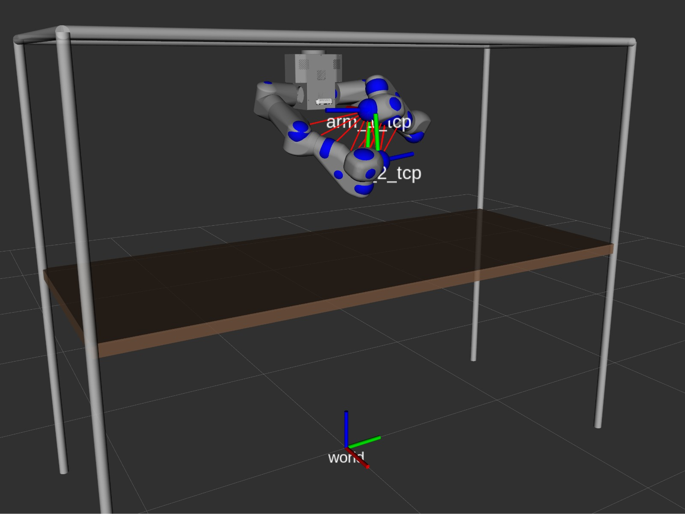

# DawnIK Solver - Repair Robot Integraton

DawnIK Solver [1]  is a real-time inverse kinematics solver for robotic arms focusing on observation capabilities with collision avoidance and multiple objectives.

## Repair Robot



## Dependencies

```bash
################# ROS DEPENDENCIES ##################################
$ cd catkin_ws/src

# This package
$ git clone git@gitlab.igg.uni-bonn.de:phenorob/oc2/active_perception/salih_marangoz_thesis.git -b repair_integration

# Fake Joints (optional alternative to Gazebo) (forked and modified)
$ git clone https://github.com/salihmarangoz/fake_joint

# For robot state collision evaluation
$ git clone git@gitlab.igg.uni-bonn.de:phenorob/oc2/active_perception/moveit_collision_check.git

# Others
$ cd catkin_ws
$ rosdep install --from-paths src --ignore-src -r
$ sudo apt install python3-yaml python-is-python3
$ pip install pyyaml

################## EXTERNAL DEPENDENCIES ############################

# Ceres Solver 2.x.x (http://ceres-solver.org/installation.html)
$ cd $HOME
#$ git clone git@github.com:salihmarangoz/ceres-solver.git
$ git clone git@github.com:ceres-solver/ceres-solver.git -b 2.2.0rc1
$ sudo apt-get install cmake libgoogle-glog-dev libgflags-dev libatlas-base-dev libeigen3-dev libsuitesparse-dev
$ cd ceres-solver
$ mkdir build
$ cd build
$ cmake -DCMAKE_BUILD_TYPE=Release -DUSE_CUDA=OFF ..
$ make -j8
$ sudo make install

# Update dynamic linker run-time bindings
sudo ldconfig
```

## Running

### Simulation

```bash
# select one!

# For Fake Joints:
$ roslaunch dawn_ik repair_fake.launch

# For Gazebo:
$ roslaunch dawn_ik repair_fake.launch launch_gazebo:=true
```

### Code Generation - Skip if you are using pre-generated headers

**BE CAREFUL:** MAKE SURE JOINTS DONT HAVE EXTRA POSITION LIMITS. SOME CONFIGURATIONS LIMIT JOINT POSITIONS BETWEEN [-PI,+PI] FOR MORE STABLE MOVEIT SOLUTIONS.

Make sure the robot description is loaded. (if the fake/sim is running then it is probably loaded). Re-compile the project after this step. 

```bash
# To skip the code generation step, replace autogen_test.h with pre-generated headers (repair_arm_1.h, repair_arm_2.h.)
$ roscd dawn_ik/include/dawn_ik/robot_configuration

# select one!
$ cp repair_arm_1.h autogen_test.h
$ cp repair_arm_1.h autogen_test.h

############################################
# To do the code generation step:

# select one!
$ rosrun dawn_ik robot_parser_node _cfg:=repair_arm_1
$ rosrun dawn_ik robot_parser_node _cfg:=repair_arm_2

# Re-compile the project after this step. 
$ catkin build
```

### DawnIK Solver/Controller

```bash
$ roslaunch dawn_ik repair_solver.launch
```

### Experiments

Before doing the experiments make sure that:

- Generated code is for that robot, while using dawn_ik.

For doing the experiments you can start everything **ALL-IN-ONE** line. Stop roscore and all other things.

```bash
# Fake Joints + Rviz
$ roslaunch dawn_ik run_experiment.launch robot_name:=repair solver:=dawn_ik

# Gazebo + Rviz
$ roslaunch dawn_ik run_experiment.launch robot_name:=repair solver:=dawn_ik use_gazebo:=true
```

Both arms move in XZ plane.
- Arm_1 follows a Circle.
- Arm_2 follows an Eight.
- Waypoints are located in `waypoints` folder. 


### Footnotes

- [1] [Ceres Solver](http://ceres-solver.org/) is heavily used in this project so we named this project similar to [how Ceres Solver is named](http://ceres-solver.org/#f1). [Dawn](https://solarsystem.nasa.gov/missions/dawn/overview/) is the spacecraft launched in 2007 by NASA, reached to Ceres in 2015 and acquired the dwarf planet's information of global shape, mean density, surface morphology, mineralogy, etc. by the middle of 2016. 

